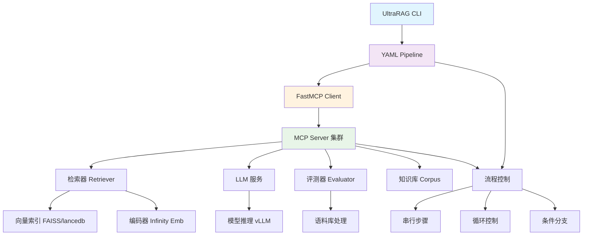

# UltraRAG 2.0 - RAG实验加速器

## 项目概述

UltraRAG 2.0 是由清华大学 THUNLP 实验室、东北大学 NEUIR 实验室、OpenBMB 和 AI9stars 联合推出的基于 Model Context Protocol (MCP) 架构设计的检索增强生成(RAG)框架。

**核心思想**: 通过组件化封装和 MCP 架构，实现低代码构建复杂 RAG Pipeline，让科研人员专注算法创新而非工程实现。

## 架构总览



## 核心模块

### 1. 核心引擎 (src/ultrarag/)
- **client.py**: 主要客户端逻辑，Pipeline 执行引擎
- **server.py**: 服务端管理与配置
- **api.py**: 对外接口层
- **cli.py**: 命令行接口
- **utils.py**: 工具函数
- **mcp_exceptions.py**: MCP 异常处理
- **mcp_logging.py**: 日志管理

### 2. 知识库与检索 (modelscope/)
- ModelScope 平台集成
- 检索器组件与向量数据库

### 3. Pipeline 系统 (pipelines/)
- **search_o1/**: Search-o1 复杂推理流程
- **retriever/**: 检索器模块
- **embeddings/**: 编码器服务

### 4. 数据管道 (ingestion_pipeline/)
- 知识库构建
- 数据预处理与嵌入

## 关键技术栈

- **协议层**: FastMCP 2.11.3
- **数据库**: ChromaDB (向量检索)
- **LLM 服务**: vLLM 推理引擎
- **编码服务**: Infinity Embeddings
- **向量数据库**: FAISS, LanceDB
- **文档解析**: Llama-Index, Chonkie
- **向量索引**: 支持多种后端

## 全局规范

### 开发环境
```bash
conda create -n ultrarag python=3.11
pip install uv
uv pip install -e .
```

## 快速开始

### 验证安装
```bash
ultrarag run examples/sayhello.yaml
```

### 核心流程
1. **YAML 配置**: 声明 Pipeline 逻辑
2. **参数注入**: 通过 parameter.yaml 配置
3. **执行流程**: 内置流程控制系统

## 导航路线

- `src/ultrarag/` - 核心引擎与客户端
- `modelscope/` - ModelScope 集成与检索
- `pipelines/` - 标准 Pipeline 模板
- `servers/` - MCP Server 实现
- `examples/` - 用例演示与基准测试
- `ingestion_pipeline/` - 知识库构建流程